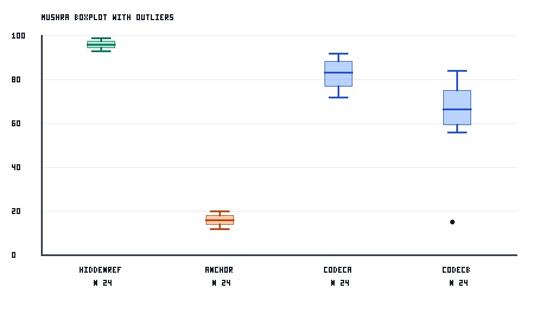

# MUSHRA 主观听音评价报告

报告对象：`raw_mushra_0_to_1.csv` 测试用例  
处理脚本：`scripts/mushra_analyzer.py`  
生成日期：2026-05-21  
标准口径：参考 ITU-R BS.1534-3，原始主观评分先线性归一化至 0-100 MUSHRA 标尺，再执行控制项后筛、统计汇总和箱线图异常值标记。

## 1. 数据与处理流程

本测试用例使用 8 名听音者、4 个测试材料、2 个系统条件，并包含 Hidden Reference 与 Anchor 控制项。原始评分采用 0-1 标尺，用来验证处理脚本是否能按 BS.1534-3 的 MUSHRA 评分标尺进行线性归一化。新版测试集将系统评分分布拉开，避免箱线图过于集中。

归一化公式如下：

```text
normalized_score = (raw_score - raw_score_min)
                   / (raw_score_max - raw_score_min)
                   * 100
```

| 参数 | 取值 |
|---|---:|
| 原始评分范围 | 0 - 1 |
| 归一化评分范围 | 0 - 100 |
| Hidden Reference 合格阈值 | >= 90 |
| Anchor 合格阈值 | <= 20 |
| Hidden Reference 听音者失败率剔除阈值 | > 15% |
| Anchor 听音者失败率剔除阈值 | > 15% |
| 筛选粒度 | listener |


## 2. 样例数据设计

| 听音者/条件 | 设计意图 | 预期结果 |
|---|---|---|
| S02 | 1 个材料的 Hidden Reference 原始分为 0.85，归一化后为 85 | Hidden Reference 失败率 25%，剔除 |
| S03 | 1 个材料的 Anchor 原始分为 0.25，归一化后为 25 | Anchor 失败率 25%，剔除 |
| S08 / seq4 / CodecB | 系统评分原始分为 0.15，归一化后为 15 | 不触发控制项剔除，但作为箱线图异常值标记 |

系统评分分布已放宽：CodecA 覆盖约 72-92 分，CodecB 覆盖约 56-84 分并保留一个 15 分异常点。

## 3. 数据筛选结果

| 指标 | 数值 |
|---|---:|
| 原始评分行数 | 128 |
| 有效保留评分行数 | 96 |
| 原始听音者数 | 8 |
| 保留听音者数 | 6 |
| 剔除听音者数 | 2 |
| 原始材料数 | 4 |
| 保留材料数 | 4 |
| 非数值/越界评分行数 | 0 |
| 箱线图异常值数量 | 1 |

被剔除听音者如下：

| 听音者 | Hidden Reference 失败率 | Anchor 失败率 | 是否剔除 | 剔除原因 |
|---|---:|---:|---|---|
| S02 | 25.00% | 0.00% | 是 | hidden_ref_fail_rate 25.00% > 15.00% |
| S03 | 0.00% | 25.00% | 是 | anchor_fail_rate 25.00% > 15.00% |

其余 S01、S04、S05、S06、S07、S08 均通过控制项后筛。

## 4. 系统条件统计结果

剔除 S02 与 S03 后，仅对保留听音者的系统条件评分进行统计。

| 系统条件 | 排名 | n | 均值 | 中位数 | 标准差 | 95% CI 下限 | 95% CI 上限 | Q1 | Q3 | 异常值 |
|---|---:|---:|---:|---:|---:|---:|---:|---:|---:|---|
| CodecA | 1 | 24 | 82.8333 | 83.25 | 6.4127 | 80.2677 | 85.3990 | 77.00 | 88.25 | 无 |
| CodecB | 2 | 24 | 66.5417 | 66.50 | 14.0665 | 60.9139 | 72.1695 | 59.50 | 75.25 | 15 |

CodecA 的均值和中位数均高于 CodecB。CodecB 的均值受到一个低分异常点影响，箱线图中该点被保留并标出。

## 5. 箱线图

下图使用 JPG 图片文件展示，避免 GitHub Markdown 将内联 SVG 当作代码块显示。黑色圆点表示按 1.5 x IQR 规则识别出的统计异常值。



图中可见：

| 观察点 | 说明 |
|---|---|
| Hidden Reference | 通过后筛的听音者中，参考项集中在高分区间 |
| Anchor | 锚点项在 20 分及以下，符合默认合格阈值 |
| CodecA | 分布较上一版更分散，整体均值仍最高 |
| CodecB | 主体分布更分散，存在一个 15 分异常值 |

## 6. 结论

本测试用例验证通过。处理脚本能够正确完成以下工作：

1. 将 0-1 原始主观评分按 BS.1534-3 的 MUSHRA 标尺线性归一化到 0-100。
2. 正确应用默认阈值：Hidden Reference >= 90，Anchor <= 20。
3. 正确识别 Hidden Reference 低分导致的不合格听音者 S02。
4. 正确识别 Anchor 高分导致的不合格听音者 S03。
5. 保留通过控制项后筛的听音者数据，并输出系统条件统计结果。
6. 在箱线图中保留并标记 CodecB 的 15 分异常评分。

综合本测试数据，CodecA 的主观质量评分优于 CodecB：CodecA 均值为 82.8333，CodecB 均值为 66.5417，均值差约 16.2916 分。该结论建立在控制项后筛之后的有效数据上。

## 7. 输出文件索引

| 文件 | 用途 |
|---|---|
| `raw_mushra_0_to_1.csv` | 测试用例原始数据 |
| `analysis/all_scores_with_flags.csv` | 全量评分与筛选标记 |
| `analysis/clean_scores.csv` | 后筛后的全部有效评分 |
| `analysis/clean_system_scores.csv` | 后筛后的系统条件评分 |
| `analysis/listener_screening.csv` | 听音者级后筛明细 |
| `analysis/trial_screening.csv` | subject-item 级控制项明细 |
| `analysis/condition_summary_systems.csv` | 系统条件统计汇总 |
| `analysis/statistical_outliers.csv` | 箱线图异常值列表 |
| `analysis/boxplot.svg` | 黑体 SVG 箱线图 |
| `analysis/boxplot.jpg` | JPG 兜底图 |
| `analysis/boxplot.png` | PNG 兜底图 |
| `analysis/conclusion.md` | 脚本自动生成结论 |
